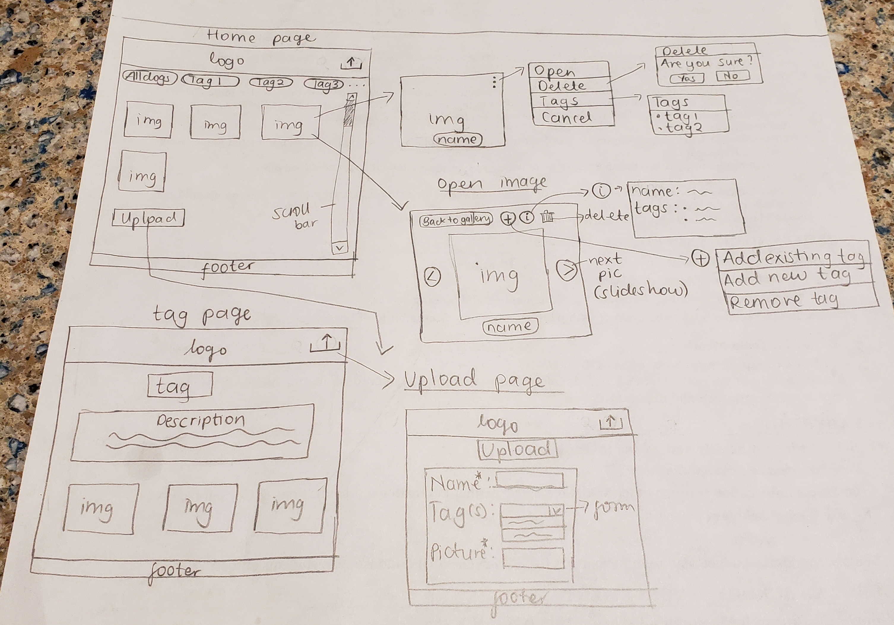

# Project 3: Design Journey

Be clear and concise in your writing. Bullets points are encouraged.

**Everything, including images, must be visible in VS Code's Markdown Preview.** If it's not visible in Markdown Preview, then we won't grade it.

# Design & Plan (Milestone 1)

## Describe your Gallery (Milestone 1)
> What will your gallery be about? 1 sentence.
- My gallery will a dog image gallery with different categories for dogs, according to their abilities.


> Will you be using your existing Project 1 or Project 2 site for this project? If yes, which project?
- No


> If using your existing Project 1 or Project 2, please upload sketches of your final design here.


## Target Audience(s) (Milestone 1)
> Tell us about your target audience(s).
- My target audience is dog lovers who would like to know more about dogs' abilities.


## Design Process (Milestone 1)
> Document your design process. Show us the evolution of your design from your first idea (sketch) to design you wish to implement (sketch). Show us the process you used to organize content and plan the navigation (card sorting), if applicable.
> Label all images. All labels must be visible in VS Code's Markdown Preview.
> Clearly label the final design.
- Cardsorting and sketches: 


## Design Patterns (Milestone 1)
> Explain how your site leverages existing design patterns for image galleries.
- Like Google image search results, I will list all tags as nav buttons at the top of the home page, with the primary home page showing all dogs, but when a tag is clicked on, I show dogs associated to that tag.
- Like Instagram, I will have 3 dots at the right top corner of each image which brings a sub-menu when clicked on.
- Like Google Photos, when an image is clicked on, I will have a back button to the tag/photo gallery, back and forward button for navigating between photos in the gallery, delete button, details button, add button for editing tags. Also when buttons are hovered over, a small decription box with the action appears.

> Identify the parts of your design that leverage existing design patterns and justify their usage.
- On the home page, I will have images of all the dogs displayed and a nav bar with all the tags. When a tag is clicked on, the page will display all dogs associated with that tag. This would be an easy way for users to switch between all the dogs and different tags.
- When a user hovers over an image, the image will have the 3 dots in the top right corner highlighted, and the name of the dog highlighted at the bottom. When a user clicks on the 3 dots, they get a sub-menu where they can open the image, delete the image, view tags and cancel the sub-menu. The sub-menu helps the user do actions without being directed to the image. The user can also view the image by clicking on it.
- When the user clicks on an image, the image opens up with a back button to the gallery, back and forward buttons for images in the same gallery (slideshow), the dog's name at the bottom of the image, a bin icon for deleting the image, an information button for view additional information, a plus button for editing tags. When a user hovers over buttons, a small decription box with the action appears, e.g., the bin, a small box with "Delete" appears.
> Most of your site should leverage existing patterns. If not, fully explain why your design is a special case (you need to have a very good reason here to receive full credit).


## Requests (Milestone 1)
> Identify and plan each request you will support in your design.
> List each request that you will need (e.g. view image details, view gallery, etc.)
> For each request, specify the request type (GET or POST), how you will initiate the request: (form or query string param URL), and the HTTP parameters necessary for the request.

Example:
- Request: view movie details
  - Type: GET
  - Params: id _or_ movie_id (movies.id in DB)

- Request: view specific tag gallery
  - Type: GET
  - Params: tags.id (tags.id in DB)
  - How: query string param URL

- Request: view image tags (3 dots)
  - Type: GET
  - Params: tags.name (tags.name in DB)
  - How: query string param URL

- Request: view dog image
  - Type: GET
  - Params: dogs.id (dogs.id in DB)
  - How: query string param URL

- Request: edit tags information
  - Type: POST
  - Params: tags.id, tags.name, dogs.tag_id
  - How: form

- Request: delete image
  - Type: POST
  - Params: dogs.id
  - How: form

- Request: Upload dog record
  - Type: POST
  - Params: dogs.name, dogs.tag_id, tags.id
  - How: form


## Database Schema Design (Milestone 1)
> Plan the structure of your database. You may use words or a picture.
> Make sure you include constraints for each field.

> Hint: You probably need `images`, `tags`, and `image_tags` tables.

> Hint: For foreign keys, use the singular name of the table + _id. For example: `image_id` and `tag_id` for the `image_tags` table.


Example:
```
movies (
id : INTEGER {PK, U, Not, AI}
field2 : ...
...
)
```

```
dogs (
  id: INTEGER {PK, UNIQUE, NOT NULL, AI}
  name: TEXT {NOT NULL, UNIQUE}
  file_name: TEXT {NOT NULL, UNIQUE}
  tags_id: INTEGER
)

tags (
  id: INTEGER {PK, UNIQUE, NOT NULL, AI}
  name: TEXT {NOT NULL, UNIQUE}
)

```


## Database Query Plan (Milestone 1)
> Plan your database queries. You may use natural language, pseudocode, or SQL.
> Using your request plan above, plan all of the queries you need.

```sql
CREATE TABLE dogs(
  id INTEGER NOT NULL PRIMARY KEY AUTOINCREMENT UNIQUE,
  name TEXT NOT NULL UNIQUE,
  file_name TEXT NOT NULL UNIQUE,
  file_ext TEXT NOT NULL
);

INSERT INTO dogs (id, name, file_name, file_ext) VALUES (...);

CREATE TABLE tags (
  id INTEGER NOT NULL PRIMARY KEY AUTOINCREMENT UNIQUE,
  name TEXT NOT NULL UNIQUE
);

INSERT INTO tags (id, name) VALUES (...);

CREATE TABLE dogs_tags (
  id INTEGER NOT NULL PRIMARY KEY AUTOINCREMENT UNIQUE,
  dogs_id INTEGER NOT NULL,
  tags_id INTEGER NOT NULL
);

INSERT INTO dogs_tags (id, dogs_id, tags_id) VALUES (...);


/*display all dogs*/
SELECT dogs.name FROM dogs ORDER BY dogs.name;

/* display all tags*/
SELECT DISTINCT tags.name FROM tags ORDER BY tags.name;

/*display all dogs in specific tag*/
SELECT dogs.name FROM dogs_tags INNER JOIN dogs ON dogs.id = dogs_tags.dogs_id WHERE dogs_tags.tags_id= ... ORDER BY dogs.name;


/* display name on particular dog*/
SELECT dogs.name FROM dogs WHERE file_name=...;

/* display all tags on particular dog*/
SELECT DISTINCT tags.name FROM dogs_tags INNER JOIN tags ON dogs_tags.tags_id = tags.id WHERE dogs_tags.dogs_id = ... ORDER BY tags.name;

/* add new tag to dog*/
INSERT INTO tags (name) VALUES (...);
INSERT INTO dogs_tags (dogs_id, tags_id) VALUES (...);

/* add existing tag to dog*/
INSERT INTO dogs_tags (dogs_id, tags_id) VALUES (...);

/* add new image/dog record */
/* if new tag, create a new tag too*/
INSERT INTO dogs ( name, file_name, file_ext) VALUES (...);
INSERT INTO dogs_tags (dogs_id, tags_id) VALUES (...);

/* delete a dog record */
DELETE FROM tags WHERE tags.dogs_id = ...;
DELETE FROM dogs WHERE dogs.id = ...;

/*remove a tag from an existing dog*/
DELETE FROM dogs_tags WHERE dogs_tags.dogs_id= ... AND dogs_tags.tags_id = .... ;

```


## Code Planning (Milestone 1)
> Plan what top level PHP pages you'll need.
- I will have a home page where all the images will be displayed. When a user clicks on a tag, I will dynamically change the content of the same page to display the tag's images.

> Plan what partials you'll need.
- I will need a header with the logo, upload button and a navbar with all the tags.
- I will also need a footer.

> Plan any PHP code you'll need.

Example:
```php
//header.php
  
  <nav bar with all titles>
    if nav bar element (tag) clicked, make $tag = tag clicked and highlight element (CSS). Change content displaying on page to specific tag: if $tag = tag X, $sql, display SQL results
  </nav>

//index.php
  <main>
 <?php if($tag=="All" ) { ?>
   <h1>All Dogs<h1>
   <?php
   $sql= "SELECT dogs.file_name FROM dogs ORDER BY dogs.name;";
   $params=array();
   $records = exec_sql_query($db, $sql, $params)->fetchAll();
   if (count($records)>0){
     foreach ($records as $image){ ?>
        " alt=""><a href="..."></img>   <?php
     }
   }
 }
   else{ ?>
     <h1><?php echo $tag?><h1>
     <?php
     $sql = "...";
     $params=array();
     $records = exec_sql_query($db, $sql, $params)->fetchAll();
   if (count($records)>0){
     foreach ($records as $image){ ?>
        " alt=""><a href="..."></img> <?php
     }
   }
   }
     ?>

 </main>

```


# Complete & Polished Website (Final Submission)

## Gallery Step-by-Step Instructions (Final Submission)
> Write step-by-step instructions for the graders.
> For each set of instructions, assume the grader is starting from index.php.

Viewing all images in your gallery:
1.
2.

View all images for a tag:
1.
2.

View a single image and all the tags for that image:
1.
2.

How to upload a new image:
1.
2.

How to delete an image:
1.
2.

How to view all tags at once:
1.
2.

How to add a tag to an existing image:
1.
2.

How to remove a tag from an existing image:
1.
2.


## Reflection (Final Submission)
> Take this time to reflect on what you learned during this assignment. How have you improved since starting this class?
