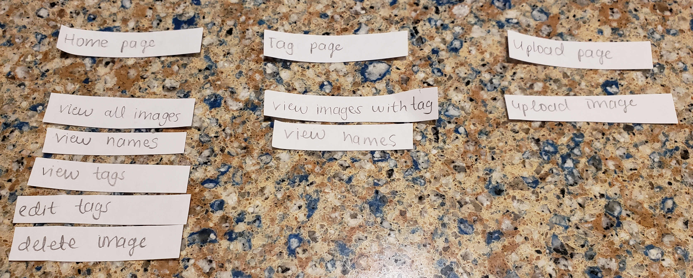
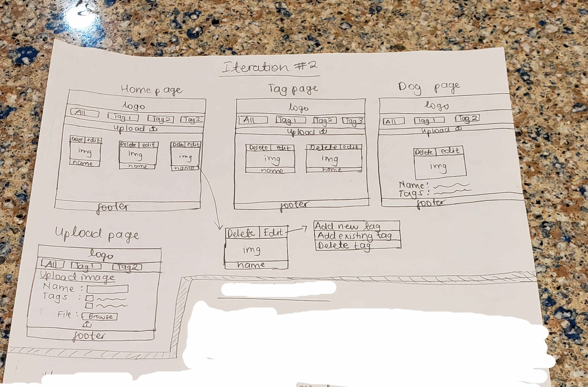
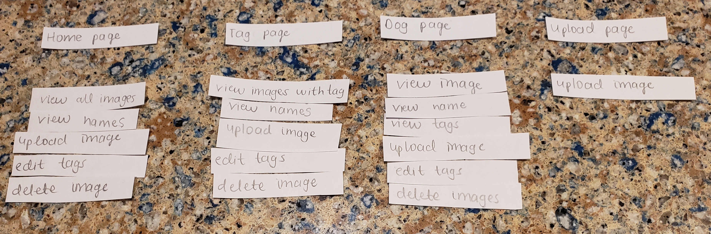
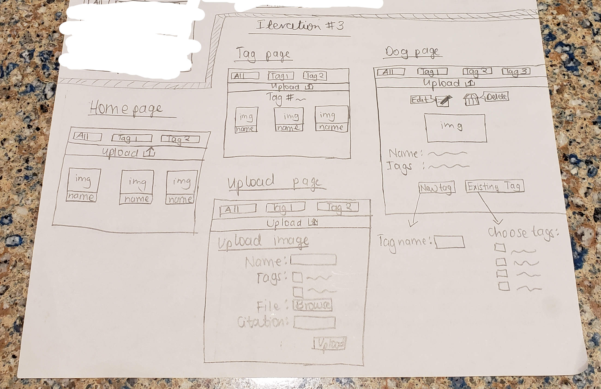
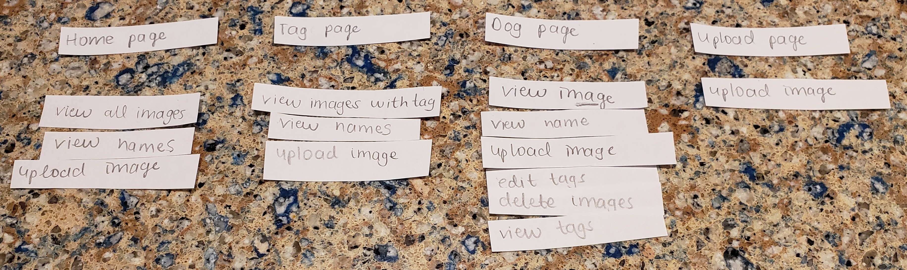

# Project 3: Design Journey

Be clear and concise in your writing. Bullets points are encouraged.

**Everything, including images, must be visible in VS Code's Markdown Preview.** If it's not visible in Markdown Preview, then we won't grade it.

# Design & Plan (Milestone 1)

## Describe your Gallery (Milestone 1)
> What will your gallery be about? 1 sentence.
- My gallery will a dog image gallery with different categories for dogs, according to their abilities/what they're best known for.


> Will you be using your existing Project 1 or Project 2 site for this project? If yes, which project?
- No


> If using your existing Project 1 or Project 2, please upload sketches of your final design here.


## Target Audience(s) (Milestone 1)
> Tell us about your target audience(s).
- My target audience is dog lovers who would like to view images of dogs, know more about their abilities, upload their own dog's images and tag their abilities.The tag audience can also edit existing tags on a dog, if for example their dog's image is already on the gallery, but they want to edit the dog's capabilities.


## Design Process (Milestone 1)
> Document your design process. Show us the evolution of your design from your first idea (sketch) to design you wish to implement (sketch). Show us the process you used to organize content and plan the navigation (card sorting), if applicable.
> Label all images. All labels must be visible in VS Code's Markdown Preview.
> Clearly label the final design.
- Iteration #1: Sketch 1: Cardsort 1:
- In the first iteration, I planned to have 3 pages: home page, tag page, upload image. Home page would handle most of the functionalities, i.e., viewing the image, delete image, view tags, edit (add and delete) tags, using popup dialog boxes as shown. Tag page would display all the images associated with a certain tag and upload page would handle image uploads. I put most of the functionality on the Home page to leverage Google Photo's gallery, but upon further considerations and consultations, I realized that a lot of those functionalities (like popups and sildeshows) would require heavy use of Javascript which I was not comfortable with. I then revised my design.

- Iteration #2: Sketch 2: Cardsort 2:
- I spread out the original functionalities on the homepage to the tag page and a new dog page that would handle more of the functionalities. Home page would then display all the images. Dog page would display the image of the specific dog. All pages except for upload page would also handle edit (add and delete) tags and delete images from a small sub-menu at the top of the image, enabling the user to do this from any page with the image.

- Iteration #3: Sketch 3: Cardsort 3:
- I moved the edit (add and delete) tags and delete image functionalities to the dog page because the other pages would be too crowded with buttons, so I choose to have the functionalities happen on the specific dog's page.
- I also changed the edit, delete, upload submit buttons to icons to reduce the "submit-like" buttons which would not add to the visual imagery of the image gallery. I used a pen scribbling on a paper as the edit tags icon, a bin as the delete image icon and an upward arrow for the upload button.
- I also removed the header logo as the logo would not be adding content or importance to the website, rather crowding up the pages with an irrelevant logo. I also removed the footer because I did not have relevant information to put in the footer.
- I moved the upload button to the top of every page so that the users don't have to scroll/guess where the uplod button is.


## Design Patterns (Milestone 1)
> Explain how your site leverages existing design patterns for image galleries.
- Like Google image search results, I will list all tags as nav buttons at the top of the home page, with the primary home page showing all dogs, but when a tag is clicked on, I show dogs associated to that tag.
- Like Google Photos, when an image is clicked on, I will have a back button to the tag/photo gallery, back and forward button for navigating between photos in the gallery, delete button, details button, add button for editing tags. Also when buttons are hovered over, a small decription box with the action appears.

#### Update
- I decided not to develop the slideshow part because I am not comfortable with Javascript.

> Identify the parts of your design that leverage existing design patterns and justify their usage.
- On the home page, I will have images of all the dogs displayed and a nav bar with all the tags. When a tag is clicked on, the page will display all dogs associated with that tag. This would be an easy way for users to switch between all the dogs and different tags.
- When a user hovers over an image, the image will have the 3 dots in the top right corner highlighted, and the name of the dog highlighted at the bottom. When a user clicks on the 3 dots, they get a sub-menu where they can open the image, delete the image, view tags and cancel the sub-menu. The sub-menu helps the user do actions without being directed to the image. The user can also view the image by clicking on it.
- When the user clicks on an image, the image opens up with a back button to the gallery, back and forward buttons for images in the same gallery (slideshow), the dog's name at the bottom of the image, a bin icon for deleting the image, an information button for view additional information, a plus button for editing tags.
- When a user hovers over buttons, a small decription box with the action appears, e.g., the bin, a small box with "Delete" appears.

#### Update
- I did not implement the 3 dots at the top right corner to remove the clutter from the home page and tag page. Instead I moved the functionalities to the dog page, where I did not need to have the 3 dots, but the options (edit tags and delete image) visible.
- I did not implement the slideshow part because I am not comfortable with Javascript.

> Most of your site should leverage existing patterns. If not, fully explain why your design is a special case (you need to have a very good reason here to receive full credit).
- For editing the tags, I decided to do implement that at the bottom of the page, so that when the user hovers on the edit button, a text box appears, telling them to edit the tags below. I did this to reduce the iterruption at the top of the page, above the image. The user then chooses between adding a new tag or edit existing tags. For the new tag, they input the tag name and click on the submit button.
- For editing the existing tags, I chose to have a checkbox that displays all the existing tags. The tags that are already applied to the image are already checked. If a user wants to remove a tag from an image, they can uncheck the tag. To add a tag, they can check an existing tag, then press submit, applying the changes.

##### Theme
- I decided to work with blue tones because blue is a cool color, evoking a relaxing feeling. My website should be a relaxing place where dog lovers and enthusiasts can enjoy looking at dogs. I work with 2 shades of blue. The dark shade being used when an element is hovered over or on the borders of the nav bar elements
- I used a white background to ensure there's enough contrast between the elements and the background. While some images have white backgrounds, I did not put a border around the images unless the images is hovered over, so as to create harmony between the foreground and background.
- I arranged my images in a grid style and put the amount of spacing I did to show the closeness of images (relationship between images eg same tag), but I also spaced them out to reduce cluttering on the page. I also maintained the grid style on the home page and tags page to ensure consistency, with only upload page and dog page changing because they don't have galleries.

## Requests (Milestone 1)
> Identify and plan each request you will support in your design.
> List each request that you will need (e.g. view image details, view gallery, etc.)
> For each request, specify the request type (GET or POST), how you will initiate the request: (form or query string param URL), and the HTTP parameters necessary for the request.

Example:
- Request: view movie details
  - Type: GET
  - Params: id _or_ movie_id (movies.id in DB)

- Request: view specific tag gallery
  - Type: GET
  - Params: tags.id
  - How: query string param URL

- Request: view dog page (specific dog)
  - Type: GET
  - Params: dogs.id
  - How: query string param URL

- Request: edit tags information
  - Type: POST
  - Params: dogs.id, dogs_tags.dog_id, tags.id
  - How: form

- Request: delete image
  - Type: POST
  - Params: dogs.id, dogs_tags.dog_id
  - How: form

- Request: Upload dog record
  - Type: POST
  - Params: dogs.name, dogs_tags.dog_id, tags.id
  - How: form


## Database Schema Design (Milestone 1)
> Plan the structure of your database. You may use words or a picture.
> Make sure you include constraints for each field.

> Hint: You probably need `images`, `tags`, and `image_tags` tables.

> Hint: For foreign keys, use the singular name of the table + _id. For example: `image_id` and `tag_id` for the `image_tags` table.


Example:
```
movies (
id : INTEGER {PK, U, Not, AI}
field2 : ...
...
)
```

```sql
dogs (
  id: INTEGER {PK UNIQUE NOT NULL AI}
  name: TEXT {NOT NULL}
  file_name: TEXT {NOT NULL}
  file_name: TEXT {NOT NULL}
  file_ext: TEXT {NOT NULL}
  citation: TEXT {NOT NULL}

)

tags (
  id: INTEGER {PK, UNIQUE, NOT NULL, AI}
  name: TEXT {NOT NULL, UNIQUE}
)

dogs_tags (
  id: INTEGER {NOT NULL PRIMARY KEY AUTOINCREMENT UNIQUE}
  dog_id: INTEGER {NOT NULL}
  tag_id: INTEGER {NOT NULL}
)

```
#### Updates
- I added the 3rd table to have a table solely for the relationship between the 2 tables, contrary to the 2 tables I had earlier that had everything, making it easier to track everything.
- I added the file_ext and citation fields to the dogs table, to make it easier display images and have citations for each image respectively.


## Database Query Plan (Milestone 1)
> Plan your database queries. You may use natural language, pseudocode, or SQL.
> Using your request plan above, plan all of the queries you need.

```sql
CREATE TABLE dogs(
  id INTEGER NOT NULL PRIMARY KEY AUTOINCREMENT UNIQUE,
  name TEXT NOT NULL,
  file_name TEXT NOT NULL,
  file_ext TEXT NOT NULL,
  citation TEXT NOT NULL
);

INSERT INTO dogs (id, name, file_name, file_ext, citation) VALUES (...);

CREATE TABLE tags (
  id INTEGER NOT NULL PRIMARY KEY AUTOINCREMENT UNIQUE,
  name TEXT NOT NULL UNIQUE
);

INSERT INTO tags (id, name) VALUES (...);

CREATE TABLE dogs_tags (
  id INTEGER NOT NULL PRIMARY KEY AUTOINCREMENT UNIQUE,
  dog_id INTEGER NOT NULL,
  tag_id INTEGER NOT NULL
);

INSERT INTO dogs_tags (id, dog_id, tag_id) VALUES (...);


/*display all dogs*/
SELECT dogs.name FROM dogs ORDER BY dogs.name;

/* display all tags*/
SELECT DISTINCT tags.name FROM tags ORDER BY tags.name;

/*display all dogs in specific tag*/
SELECT dogs.name FROM dogs_tags INNER JOIN dogs ON dogs.id = dogs_tags.dog_id WHERE dogs_tags.tag_id= ... ORDER BY dogs.name;


/* display name on particular dog*/
SELECT dogs.name FROM dogs WHERE file_name=...;

/* display all tags on particular dog*/
SELECT DISTINCT tags.name FROM dogs_tags INNER JOIN tags ON dogs_tags.tag_id = tags.id WHERE dogs_tags.dog_id = ... ORDER BY tags.name;

/* add new tag to dog*/
INSERT INTO tags (name) VALUES (...);
INSERT INTO dogs_tags (dog_id, tag_id) VALUES (...);

/* add existing tag to dog*/
INSERT INTO dogs_tags (dog_id, tag_id) VALUES (...);

/* add new image/dog record */
/* if new tag, create a new tag too*/
INSERT INTO dogs ( name, file_name, file_ext, citation) VALUES (...);
INSERT INTO dogs_tags (dog_id, tag_id) VALUES (...);

/* delete a dog record */
DELETE FROM tags WHERE dogs_tags.dog_id = ...;
DELETE FROM dogs WHERE dogs.id = ...;

/*remove a tag from an existing dog*/
DELETE FROM dogs_tags WHERE dogs_tags.dog_id= ... AND dogs_tags.tag_id = .... ;

```


## Code Planning (Milestone 1)
> Plan what top level PHP pages you'll need.
- I will have a home page where all the images will be displayed. When a user clicks on a tag, I will dynamically change the content of the same page to display the tag's images.

> Plan what partials you'll need.
- I will need a header with the logo, upload button and a navbar with all the tags.
- I will also need a footer.

#### Update
- I got rid of the footer and the logo in the header because of irrelevance
- I created an uploads partial that puts the upload button on all the pages.
- I put the code in the head section inside the head partial

```html
<!-- uploads partial -->
<button>Button with "upload image" and upload icon</button>

<!-- head partial -->
link stylessheets and scripts

<!-- header partial -->
<? php obtain all tag names and id ?>
<nav>Print all tags including all dogs, pass tag id in URL</nav>

```

> Plan any PHP code you'll need.

Example:
```php

// to display all images
obtain all fields for all images using sql queries
foreach($records as $images){
  
  <span>Name = obtained image_name</span>
}

//to display all images in choosen tag
obtain tag id from URL
obtain all fields from specified tag using sql queries (dogs_tags table)
foreach($records as $tags){
  obtain image id
  display each image and name
}

//display specific image
obtain image id from URL
obtain all fields from image table using sql queries
echo $image_name
echo $image_tags

//to upload an image
obtain parameters from upload form
filter and sanitize parameters
if parameters valid{
  add new image record to images table
  obtain new image id
  add choosen tags to dogs_tags table with new image id
  add uploaded file to directory/uploads
}

//to delete image record
obtain parameters from delete form
filter and sanitize form inputs
delete record from dogs_tags table (sql query)
delete record from dogs table (sql query)
delete image from disk

//to add a new tag to an existing image
obtain parameters from add form
filter and sanitize form inputs
add new tag to tags table (sql query)
obtain new tag id
add new record to dogs_tags table with new tag id (sql query)

//to edit existing tags
obtain parameters from add form
filter and sanitize form inputs
delete all records from dogs_tags table associated with that image
add tag relationships to image according to inputs

```


# Complete & Polished Website (Final Submission)

## Gallery Step-by-Step Instructions (Final Submission)
> Write step-by-step instructions for the graders.
> For each set of instructions, assume the grader is starting from index.php.

Viewing all images in your gallery:
1. Done: all images on index.php

View all images for a tag:
1. Navigate to nav bar
2. Click on desired tag on the nav bar

View a single image and all the tags for that image:
1. On index.php, look for desired image
2. Click on image
3. View tags beneath the image on the page

How to upload a new image:
1. Below the nav bar, navigate to the "upload image" button
2. Click on "upload image" button
3. Fill form on Uploads page
4. Click submit button in the form of an upload icon

How to delete an image:
1. On index.php, look for image to be deleted
2. On the image page, click the bin icon above the image
3. On the dialog box that appears, click "Delete"

How to view all tags at once:
1. All tags displayed on nav bar

How to add a tag to an existing image:
1. On index.php, look for image to be editted
2. On the image page, click the edit icon (pen) above the image
3. Navigate to the bottom of the page and click on "Edit existing image"
4. Check tag to be added
5. Click on submit button in form of a check mark

How to remove a tag from an existing image:
1. On index.php, look for image to be editted
2. On the image page, click the edit icon (pen) above the image
3. Navigate to the bottom of the page and click on "Edit existing image"
4. Uncheck tag to be deleted
5. Click on submit button in form of a check mark


## Reflection (Final Submission)
> Take this time to reflect on what you learned during this assignment. How have you improved since starting this class?
- I have learnt how to handle multiple queries for a single outcome.
- I have learnt how to initialize my sql seed data without DB browser, which I can apply to other production databases for later projects
- I have improved my debugging skills with var_dump(), examining the output console and testing sql queries using DB Browser
- I have improved my website design and aesthetics by using Mozilla's reference docs
- I have improved my trust in documentation websites like Mozilla MDN and PHP docs and learnt how to be self-reliant using the documentation.

#### citations
- I used Mozilla MDN reference documentation, PHP reference documentation, labs 7 (for Jquery), lab 5 component library on Campuswire.
